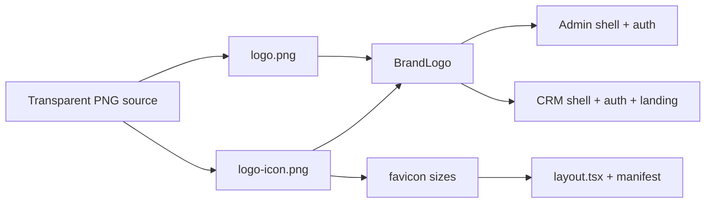

# Double Helix Hub Logo Rollout (Admin + CRM)

## Source asset

Use your **transparent PNG** as the single source of truth:

- Copy from the uploaded asset into both apps:
  - [`apps/admin/public/logo.png`](apps/admin/public/logo.png)
  - [`apps/crm/public/logo.png`](apps/crm/public/logo.png)
- **Pre-flight check at implementation:** confirm `hasAlpha: yes` via `sips`. The on-disk file at the original path still reads as a non-transparent JPEG in some copies — use whichever file you just uploaded with real transparency.
- Optimize for web: resize master to ~1600px wide max (keep aspect ratio ~2.5:1) to avoid shipping the full 4K+ source on every page load.

## Derived assets (both `public/` folders)

From the left helix portion of the wordmark (~35% width crop):

| File | Purpose | Target size |
|------|---------|-------------|
| `logo-icon.png` | Collapsed admin sidebar, small marks | 256×256 square crop |
| `favicon-32.png` | Browser tab | 32×32 |
| `apple-touch-icon.png` | iOS home screen | 180×180 |
| `icon-512.png` | CRM PWA manifest | 512×512 |

Keep or replace [`favicon.svg`](apps/admin/public/favicon.svg) only if a clean SVG trace is available; otherwise point metadata at the PNG favicons above.

Remove/replace stale assets: [`logo.svg`](apps/crm/public/logo.svg), old PIFH [`logo.png`](apps/crm/public/logo.png) copies, and duplicate full-size `logo-icon.png` files (currently identical to full logo).

## Shared component

Add [`packages/ui/src/components/brand-logo.tsx`](packages/ui/src/components/brand-logo.tsx) and export from [`packages/ui/src/index.ts`](packages/ui/src/index.ts):

```tsx
<BrandLogo variant="full" size="sm" priority />   // headers
<BrandLogo variant="icon" size="xs" />             // collapsed sidebar
```

**Size presets** (height-driven, `w-auto` for full wordmark):

| Preset | Tailwind height | Used in |
|--------|-----------------|---------|
| `xs` | `h-8` (32px) | Collapsed sidebar icon |
| `sm` | `h-8 lg:h-9` | CRM top bar |
| `md` | `h-10` | Admin sidebar expanded, footer |
| `lg` | `h-14` | Auth / password pages |
| `xl` | `h-16` | Prominent auth hero branding |

Stacked 3-line wordmark is taller than the old horizontal SVG — bump header heights slightly (`h-9`/`h-10`) so text stays legible without clipping.

## File replacements

### Admin (7 touchpoints)

| File | Change |
|------|--------|
| [`AdminSidebar.tsx`](apps/admin/src/components/layout/AdminSidebar.tsx) | `BrandLogo full md` expanded; `BrandLogo icon xs` collapsed |
| [`AdminFooter.tsx`](apps/admin/src/components/layout/AdminFooter.tsx) | `BrandLogo full md` |
| [`login/page.tsx`](apps/admin/src/app/(auth)/login/page.tsx) | **Add** `BrandLogo full lg` above "Welcome back" (currently text-only) |
| [`reset-password/page.tsx`](apps/admin/src/app/(auth)/reset-password/page.tsx) | Replace `/logo.svg` |
| [`update-password/page.tsx`](apps/admin/src/app/(auth)/update-password/page.tsx) | Replace `/logo.svg` |
| [`layout.tsx`](apps/admin/src/app/layout.tsx) | Update `metadata.icons` to PNG favicons |

### CRM (10 touchpoints)

| File | Change |
|------|--------|
| [`CrmTopBar.tsx`](apps/crm/src/components/crm/shell/CrmTopBar.tsx) | `BrandLogo full sm` |
| [`login/page.tsx`](apps/crm/src/app/(auth)/login/page.tsx) | Replace inline helix SVG + text with `BrandLogo full lg` |
| [`CrmLandingPage.tsx`](apps/crm/src/components/landing/CrmLandingPage.tsx) | Replace `HelixLogo` + separate wordmark with `BrandLogo full md`; remove unused inline SVG helper |
| [`reset-password/page.tsx`](apps/crm/src/app/reset-password/page.tsx) | Replace `/logo.svg` |
| [`update-password/page.tsx`](apps/crm/src/app/update-password/page.tsx) | Replace `/logo.svg` |
| [`CrmSidebar.tsx`](apps/crm/src/components/crm/shell/CrmSidebar.tsx) | Replace `/logo.svg` (legacy shell, keep consistent) |
| [`Footer.tsx`](apps/crm/src/components/crm/shell/Footer.tsx) | Replace `/logo.svg` |
| [`layout/sidebar.tsx`](apps/crm/src/components/layout/sidebar.tsx) | Replace `/logo.svg` |
| [`layout.tsx`](apps/crm/src/app/layout.tsx) | Update favicon/apple icons |
| [`manifest.json`](apps/crm/public/manifest.json) | Add 192/512 PNG entries; update `sw.js` precache list if needed |
| [`offline.html`](apps/crm/public/offline.html) | Point logo `` at `/logo-icon.png` |

Optional polish: add small `BrandLogo` to [`LoginHero.tsx`](apps/crm/src/components/auth/LoginHero.tsx) bottom branding (replace plain text).

## Out of scope

Portal, website, advisor-portal, and doublehelixhub apps — per your request, **admin + CRM only**.

## Verification

1. Visual check at each placement in light + dark mode (transparent PNG should have no black box).
2. Admin collapsed sidebar: icon-only crop is recognizable at 32px.
3. CRM landing nav + top bar: wordmark readable, not clipped.
4. Browser tab favicon updates after hard refresh.
5. Run `tsc --noEmit` in both apps after component import.


