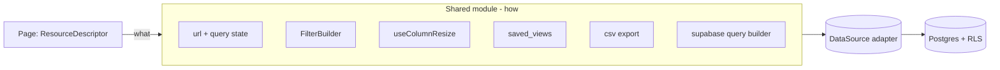

# Deep Design — Candidate 1: Shared List-View Module

> Deepening design for the architecture review's top recommendation. Feeds
> `../02 Navigation Framework.md`. Companion ADR: `../../adr/0001-shared-list-view-module.md`.
> **Design only — no app/package code is changed by this document.**

---

## 1. The problem (grounded)

Nearly every admin list page re-implements the same nine concerns inline: org
resolution, data fetch, search, filter, sort, pagination, stats, CSV export, and
row/bulk actions. Evidence:

- **`apps/admin/src/app/(dashboard)/payables/page.tsx` — 913 lines.** Contains
  its own org lookup, `fetchPayables()` with filter branches, **client-side** search
  (`payables.filter`), **client-side** pagination over a `.limit(500)` fetch, four
  hand-computed stat cards, a `getStatusBadge()`, a `formatCurrency()`, a hand-rolled
  `exportPayables()` CSV builder, plus create/detail modals and row actions.
- The same shape repeats in `billing/transactions`, `billing/list`,
  `invoices/`, `commissions/list`, and the `agents` list (which has *no* search at
  all). The members list (`members/page.tsx`) is the most advanced (saved views,
  bulk assign, dependent search) — but its capability is trapped in one page.

This is textbook **shallow duplication**: N callers each re-solve one problem, none
of them deeply. It also hides bugs — e.g. payables paginates client-side over a
capped 500-row fetch, so tenants with >500 payables silently lose rows.

Meanwhile, the deep pieces **already exist but are siloed in the CRM app**:

| Capability | Exists today at | Status |
|---|---|---|
| Column resize + persistence | `apps/crm/src/hooks/useColumnResize.ts` + `records/ResizeHandle.tsx` | Reusable, localStorage-backed |
| Advanced filter builder | `apps/crm/src/components/crm/filters/FilterBuilder.tsx` (`ViewFilter[]`, typed operators) | Reusable engine |
| Saved views | `saved_views` table + `apps/crm/src/app/api/crm/saved-views/route.ts` + `@crm-eco/lib/views` | Exists, but per-context hard-typed |
| Virtualized table | `apps/crm/src/components/crm/records/RecordTable.tsx` (1601 lines, `@tanstack/react-virtual`) | Reference implementation |
| Dumb table primitives | `packages/ui/src/components/table.tsx` | Shared, presentational only |

So this is **90% a consolidation**, not a green-field build. The move is to lift the
CRM's list machinery into a shared, domain-agnostic module and express each page as
a small descriptor.

## 2. Design goals

1. **Small interface, big implementation.** A page declares *what* (columns,
   filters, actions, data source). The module owns *how* (state, URL sync, querying,
   persistence, resize, export, empty/loading/error, a11y).
2. **Server-truth by default.** Filter/sort/paginate run in the query, not in the
   browser (fixes the payables `.limit(500)` bug).
3. **Deletion test must pass.** Removing the module must force ~10 pages to re-grow
   identical logic. If a page can trivially inline it, the abstraction is too thin.
4. **Pluggable authorization.** Row/bulk actions carry a permission key so Candidate
   3's `useCan()` slots in without touching call sites later.
5. **Reuse, don't reinvent.** Absorb `useColumnResize`, `FilterBuilder`, `saved_views`.

## 3. The interface (the whole public surface)

Everything a page needs is one descriptor + one component (plus a headless hook for
custom layouts). This is the entire boundary — nothing else is exported.

```ts
// @crm-eco/ui/data-table — public API

export interface ColumnDef<Row> {
  key: string;                     // stable id; used for sort, resize, visibility
  header: string;
  accessor: (row: Row) => unknown; // value for sort/export
  cell?: (row: Row) => React.ReactNode; // custom render (badge, currency, link)
  sortable?: boolean;              // default true
  defaultWidth?: number;           // px; resize persists per (resource, key)
  align?: 'left' | 'right' | 'center';
  exportValue?: (row: Row) => string | number; // defaults to accessor
}

export interface FilterDef {
  key: string;                     // maps to a column/db field
  label: string;
  type: 'text' | 'select' | 'number' | 'currency' | 'date' | 'datetime' | 'boolean';
  options?: { value: string; label: string }[]; // for select
}

export interface RowAction<Row> {
  id: string;
  label: string;
  icon?: React.ReactNode;
  run: (row: Row, ctx: ActionContext) => void | Promise<void>;
  visible?: (row: Row) => boolean; // e.g. only when status === 'pending'
  permission?: string;             // Candidate 3 gate
  variant?: 'default' | 'destructive';
}

export interface BulkAction<Row> {
  id: string;
  label: string;
  run: (rows: Row[], ctx: ActionContext) => void | Promise<void>;
  permission?: string;
  confirm?: string;                // confirmation copy
}

export interface ResourceDescriptor<Row> {
  /** Stable id: powers persistence keys, saved-view context, telemetry. */
  resource: string;                // e.g. 'payables'
  title: string;
  getRowId: (row: Row) => string;
  columns: ColumnDef<Row>[];
  filters?: FilterDef[];
  searchPlaceholder?: string;
  dataSource: DataSource<Row>;     // see §4 — the load-bearing seam
  rowActions?: RowAction<Row>[];
  bulkActions?: BulkAction<Row>[];
  toolbar?: React.ReactNode;       // extra buttons (e.g. "New Payable")
  onRowClick?: (row: Row) => void; // navigate to detail
  savedViews?: boolean;            // default true — uses saved_views infra
  export?: boolean | { filename?: string }; // default true
  emptyState?: { title: string; description?: string; action?: React.ReactNode };
}

/** The only component most pages render. */
export function ResourceList<Row>(props: { descriptor: ResourceDescriptor<Row> }): JSX.Element;

/** Headless variant for bespoke layouts (same brains, custom chrome). */
export function useResourceList<Row>(descriptor: ResourceDescriptor<Row>): ResourceListState<Row>;
```

A page's job shrinks to: describe columns/filters/actions and point at a data source.

## 4. The load-bearing seam: `DataSource`

Admin pages query Supabase directly (payables); others go through API routes. One
adapter type absorbs both so the module never cares which:

```ts
export type ListQuery = {
  search?: string;
  filters: AppliedFilter[];        // { key, operator, value }
  sort?: { key: string; dir: 'asc' | 'desc' };
  page: number;
  pageSize: number;
};

export type ListResult<Row> = { rows: Row[]; total: number };

export type DataSource<Row> =
  | { kind: 'fetcher'; load: (q: ListQuery) => Promise<ListResult<Row>> }
  | {
      kind: 'supabase';
      table: string;
      select: string;              // e.g. '*, category:payable_categories(name)'
      searchColumns: string[];     // ilike OR across these
      // org scoping + filter/sort/range translation handled by the module
    };
```

For the `'supabase'` kind, a single shared query builder (in `@crm-eco/lib`)
translates `ListQuery` → a scoped Supabase query: active-org filter, `ilike` search
across `searchColumns`, `FilterBuilder` operators → `.eq/.gt/.ilike/...`, `.order`,
and `.range(from,to)` for **true server pagination + exact count**. This is the one
place that logic lives — the deletion-test core of the module.

## 5. What the module hides (information-hiding boundary)

Inside the box (callers never touch): URL/query-state sync (`?q=&status=&page=`),
debounced search, filter popover UI (absorbed `FilterBuilder`), sort toggling,
pagination math + range fetch, column resize + persistence (absorbed
`useColumnResize`, key = `dt:{resource}:{col}`), column show/hide + reorder, saved
views (absorbed `saved_views`), CSV export, row selection + bulk bar, loading
skeleton / empty / error states, keyboard nav, ARIA roles, density.

Outside the box (callers own): the descriptor, cell renderers (domain formatting like
`formatCurrency`/`StatusBadge`), action business logic, and detail/create routes.



## 6. Reuse & consolidation map

| Existing asset | Action |
|---|---|
| `packages/ui/.../table.tsx` | **Keep** as presentational primitives the module composes. |
| `apps/crm/.../useColumnResize.ts` | **Move** to `@crm-eco/ui/data-table` (generalize storage-key prefix `crm_col_widths_` → `dt_col_widths_`); CRM imports from the new home. |
| `apps/crm/.../filters/FilterBuilder.tsx` + `ViewFilter` | **Lift** into the module; generalize `CrmField` → `FilterDef`. CRM keeps a thin re-export during migration. |
| `saved_views` table + `/api/crm/saved-views` | **Reuse.** Generalize `@crm-eco/lib/views` per-context types into `SavedView<TFilters>` with a `context = resource`. |
| `RecordTable.tsx` (virtualized) | **Reference**, then refactor onto the module last (opt-in virtualization for big lists). |
| `ExportButton` (`@crm-eco/ui`) | **Reuse** for the export affordance. |

Net effect: the CRM's best list features stop being CRM-only and become the platform
default — directly satisfying `02 Navigation Framework.md`.

## 7. Migration path (strangler, one page at a time)

1. **Build** `@crm-eco/ui/data-table` + `@crm-eco/lib/data-table/query.ts` behind the
   §3 interface. No pages touched yet.
2. **Pilot — payables** (self-contained, no money-mutation semantics beyond display):
   rewrite `payables/page.tsx` as a descriptor. Expected: **913 → ~150 lines**, and
   the `.limit(500)` pagination bug disappears (server range + exact count). This is
   the deletion-test proof.
3. **Roll out** to `billing/transactions`, `invoices/`, `commissions/list`, and the
   `agents` list (the agents list *gains* search/filter/bulk for free).
4. **Hardest case last — members.** Refactor `members/page.tsx` (saved views, bulk
   assign, dependent search) onto the module. If members fits cleanly, the interface
   is proven; if it needs escape hatches, fold them back into the descriptor.
5. **Delete** each page's inline search/filter/paginate/export as it migrates. Track
   deleted-line count as the success metric.

Each step ships independently and is reversible per page.

## 8. Authorization hook (sequences into Candidate 3)

`RowAction.permission` / `BulkAction.permission` are evaluated through an injected
capability checker:

```ts
// today (before the gate exists): pass-through
<ResourceList descriptor={payables} />           // actions all visible
// after Candidate 3: the module calls useCan(permission) internally
```

The module imports a single `useCan(permission: string): boolean` seam. Until
`16 Security Permissions.md` lands, `useCan` returns `true`; when the gate ships,
every list inherits per-action authorization with **zero call-site changes**. This is
exactly the "sequence C1 then C3" recommendation.

## 9. Risks & mitigations

| Risk | Mitigation |
|---|---|
| God-object / over-abstraction | Headless `useResourceList` separates brains from chrome; deletion test gates every capability added. |
| Server vs client data sources diverge | `DataSource` adapter (`fetcher` \| `supabase`) hides the difference; one query builder. |
| Domain-specific cells (badges, currency) | Stay in the caller via `cell()` — the module never learns domain formatting. |
| Big lists (records) perf | Opt-in virtualization (reuse `@tanstack/react-virtual` as `RecordTable` does). |
| Migration risk to money pages | Pilot on payables; migrate billing/commissions only after the pilot proves out; pages ship one at a time. |
| Saved-view schema drift | Reuse existing `saved_views`; generalize types rather than new table. |

## 10. Success metrics

- **Lines deleted** across migrated pages (target: payables 913 → ~150; ≥3,000 net
  lines removed across the first five pages).
- **Capability parity**: every migrated list has search + advanced filter + sort +
  server pagination + resize + saved views + export + bulk — by construction.
- **Bug fixed**: payables (and peers) paginate server-side; no >500-row truncation.
- **Deletion test**: removing the module reintroduces the same logic in ≥10 pages.

## 11. Out of scope (explicitly)

Detail/create/edit routes (that's the resource *scaffold* in `02`, a follow-on),
the permission catalog itself (Candidate 3 / `16`), and the `withApi()` wrapper
(Candidate 6 / `20`). This design is the list surface only.
