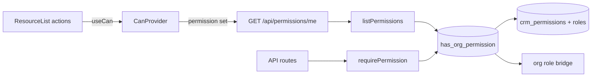

# Deep Design — Candidate 3: Unified Permission Gate

> Sequences after Candidate 1 (Shared List-View). C1 already exposes
> `RowAction.permission` / `BulkAction.permission` and evaluates them via
> `useCan()` / `CanProvider` in `@crm-eco/ui/data-table`. This design makes those
> keys real. Companion ADR: `../../adr/0002-unified-permission-gate.md`.
> Feeds `../16 Security Permissions.md` and later `../20 API Layer.md` (`withApi`).

---

## 1. The problem (grounded)

Authorization today is **half-built**:

| Layer | What exists | What's wrong |
|---|---|---|
| Catalog | `crm_permissions`, `crm_roles`, `crm_role_permissions`, `crm_user_roles` | Underused at runtime |
| DB helper | `has_crm_permission(user_id, key)` | **Not org-scoped** — joins user→roles→permissions with no `organization_id` |
| DB helper | `has_crm_role(org_id, roles[])` | Org-aware, but role-string based |
| Admin app | `requireAdminRole()` | Coarse: owner/admin/staff only |
| CRM app | `requireActiveOrgCrmRoles()` + hundreds of inline `crm_role` checks | Scattered; bypasses the permission catalog |
| UI (C1) | `useCan(permission)` in `@crm-eco/ui/data-table` | Defaults to `true` until this gate lands |

Payables pilot already declares:

```ts
permission: 'payables.approve'
permission: 'payables.pay'
```

Those keys are currently always allowed. This design wires them to the catalog.

## 2. Design goals

1. **One check API.** Code asks "can this actor do `payables.approve` in this org?" — never "is role in ['admin']?".
2. **Org-scoped, fail-closed.** Every check takes the active `organization_id`. Missing membership → deny.
3. **Small interface.** Server: `requirePermission(supabase, orgId, key)`. Client: existing `useCan(key)` fed by `CanProvider`.
4. **Bridge, don't rewrite roles overnight.** Map legacy org roles + CRM roles onto permission sets so existing admins keep working while we migrate call sites.
5. **Deletion test.** Removing the gate re-scatters role-string checks across ~300 routes and every ResourceList action.

## 3. The interface (public surface)

```ts
// @crm-eco/lib/permissions — public API

/** Server: throw/return 403 if the current user lacks the permission in org. */
export async function requirePermission(
  supabase: SupabaseClient,
  organizationId: string,
  permissionKey: string,
): Promise<{ ok: true; userId: string } | { ok: false; response: Response }>;

/** Server: boolean check (for branching, not for HTTP gate). */
export async function hasPermission(
  supabase: SupabaseClient,
  organizationId: string,
  permissionKey: string,
): Promise<boolean>;

/** Server: all permission keys for a user in an org (for client bootstrap). */
export async function listPermissions(
  supabase: SupabaseClient,
  organizationId: string,
): Promise<string[]>;

/** Well-known keys used by C1 pilots and admin modules. */
export const Permissions = {
  PayablesApprove: 'payables.approve',
  PayablesPay: 'payables.pay',
  PayablesCreate: 'payables.create',
  // …grow as modules migrate
} as const;
```

Client (already shipped in C1):

```ts
// @crm-eco/ui/data-table
<CanProvider can={(key) => permissionSet.has(key)}>
  <ResourceList descriptor={…} />
</CanProvider>
```

Admin shell (or layout) loads `listPermissions(activeOrg)` once and passes the set into `CanProvider`. ResourceList actions with `permission` keys light up / hide automatically — **zero change to payables descriptors**.

## 4. Database fix (additive)

`has_crm_permission(user_id, key)` is insufficient for multi-tenant. Add:

```sql
-- Idempotent: CREATE OR REPLACE
CREATE OR REPLACE FUNCTION public.has_org_permission(
  p_org_id uuid,
  p_permission_key text
) RETURNS boolean
LANGUAGE sql
STABLE
SECURITY DEFINER
SET search_path = public
AS $$
  SELECT
    -- Super-admin short-circuit (mirror has_crm_role)
    EXISTS (
      SELECT 1 FROM profiles
      WHERE user_id = auth.uid() AND is_super_admin = true
    )
    OR EXISTS (
      SELECT 1
      FROM crm_user_roles ur
      JOIN crm_roles r ON r.id = ur.role_id
      JOIN crm_role_permissions rp ON rp.role_id = r.id
      JOIN crm_permissions p ON p.id = rp.permission_id
      WHERE ur.user_id = auth.uid()
        AND p.key = p_permission_key
        AND (r.organization_id IS NULL OR r.organization_id = p_org_id)
    )
    -- Bridge: org membership role → implied permissions (see §5)
    OR public._org_role_implies_permission(p_org_id, p_permission_key);
$$;
```

Keep the old `has_crm_permission` for back-compat; mark deprecated in comments. All new code uses `has_org_permission`.

Seed keys used by the C1 pilot (and a starter admin set):

| key | name | category |
|---|---|---|
| `payables.approve` | Approve payables | admin |
| `payables.pay` | Mark payables paid | admin |
| `payables.create` | Create payables | admin |
| `payables.read` | View payables | admin |

Grant them to system roles that map to owner/admin (and optionally staff for `read`/`create`).

## 5. Legacy role bridge

Until every user is on `crm_user_roles`, map `organization_members.role` (and CRM `crm_role`) to implied permission sets:

| Org role | Implied permissions (v1) |
|---|---|
| `owner`, `super_admin` | `*` (all) |
| `admin` | all `payables.*` + other admin module keys as seeded |
| `staff` | `payables.read`, `payables.create` (not approve/pay) |
| `read_only` | `*.read` only |

Implement as `_org_role_implies_permission(org_id, key)` reading the caller's membership in that org. This is the **compatibility bridge** — additive, removable once catalog assignment is complete.

## 6. Information-hiding boundary



Callers never query `crm_role_permissions` directly. They never hard-code role name arrays for new code.

## 7. Migration path (strangler)

1. **Ship RPC + seed** (`has_org_permission` + payables keys) — Tier 1 migration, needs explicit approval before prod apply.
2. **Ship `@crm-eco/lib/permissions`** (`requirePermission`, `hasPermission`, `listPermissions`, `Permissions` constants).
3. **Wire admin shell** — fetch permission set for active org; wrap dashboard in `CanProvider`. Payables approve/pay buttons start respecting keys immediately.
4. **Pilot API routes** — convert 3–5 admin routes (payables mutations if/when API-ized, rates already use `requireAdminRole`) to `requirePermission` alongside or instead of role checks.
5. **CRM gradual migration** — replace inline `includes(crm_role)` with `requirePermission` / `has_crm_role` only where a permission key doesn't exist yet.
6. **Compose into `withApi()`** (Candidate 6) once the gate is stable: `{ permission: 'payables.approve' }` option.

Each step is independently shippable and reversible.

## 8. How this plugs into Candidate 1 (already done)

| C1 artifact | C3 wiring |
|---|---|
| `RowAction.permission?: string` | evaluated by `useCan` |
| `BulkAction.permission?: string` | same |
| `CanProvider` / `useCan` | admin layout supplies real `can` fn |
| Payables `payables.approve` / `payables.pay` | first seeded keys |

No payables descriptor changes required when C3 lands.

## 9. Risks & mitigations

| Risk | Mitigation |
|---|---|
| Locking out admins on day 1 | Org-role bridge grants owner/admin full access until catalog is populated |
| `has_crm_permission` org leak | New `has_org_permission`; never use the old fn for new code; two-tenant + anon isolation tests |
| Dual role systems forever | Bridge is explicit and temporary; ADR sets a removal criterion (100% of active users on `crm_user_roles`) |
| Permission key sprawl | Central `Permissions` const object; keys use `module.action` naming |
| RLS vs app gate confusion | RLS remains last line of defense; app gate is first. Both must pass. |

## 10. Verification matrix (when implementing)

- Authorized owner can approve payables (UI + API).
- `staff` (bridged) can create/read but **cannot** approve/pay.
- Different-tenant user: `has_org_permission` returns false for tenant A's keys.
- Anon: denied.
- Super-admin short-circuit still works.
- Removing `CanProvider` (or feeding empty set) hides permissioned actions (fail closed on client; server still enforces).

## 11. Out of scope

- Full migration of all ~300 CRM routes (phased after pilot).
- Per-record ACLs.
- `withApi()` wrapper (Candidate 6) — consumes this gate.
- Redesigning the security-control UI (already lists permissions).

## 12. Success metrics

- Payables approve/pay gated by keys end-to-end (UI + server).
- Zero new inline `role.includes(...)` in code touching migrated modules.
- Two-tenant + anon isolation test green for `has_org_permission`.
- Deletion test: removing `@crm-eco/lib/permissions` breaks every migrated route and every permissioned ResourceList action.
